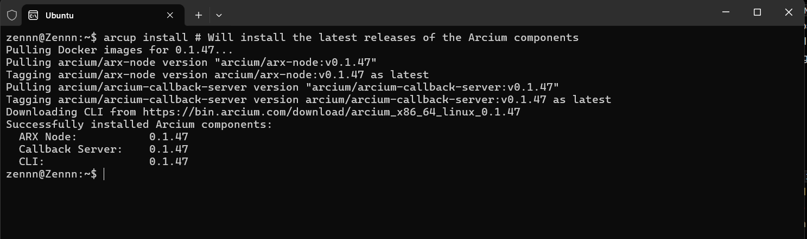

# Arcup
The ```arcup``` version manager enables easy installation and management of the Arcium Networks' tooling suite, consisting of the Arcium CLI binary, the Arx Node Docker image, the Arcium Callback Server Docker image, and the Postgres Docker image (needed to run the Callback Server).

All the necessary tools can be installed and updated whenever theres a new release. 
```
arcup install # Will install the latest releases of the Arcium components
```
You should see a similar message 👇🏾


Verify everything was installed correctly with:
```
arcium --version # Should show the latest CLI version
arcup version # Shows the currently installed versions of all of the Arcium components
docker images # Should list the images for the Arx Node, Callback Server, and Postgres
```
